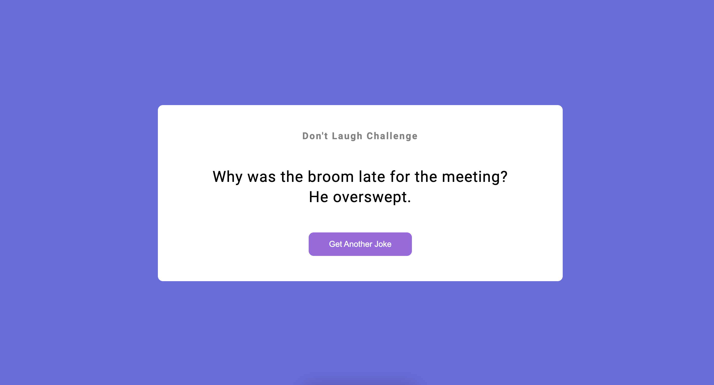

# ***Jokes Generator*** Javascript Project

> ### **Deployed Website** :-[Live Link](https://jokesgenerator-jsp.netlify.app/)
 

This is a simple web application that fetches a random dad joke from the [icanhazdadjoke](https://icanhazdadjoke.com/) API and displays it on a web page. The application uses JavaScript and the `fetch` method to communicate with the API and retrieve the joke data.

## **Usage**
To use the application, simply open the `index.html` file in a web browser. You should see a button labeled "Get Joke". Clicking the button will fetch a new dad joke and display it on the page.

## **Code**

The JavaScript code for the application is contained in the `script.js` file. It consists of a single function named `getJoke`, which uses the `fetch` method to retrieve a joke from the API, parses the response data as JSON, and updates the HTML on the page with the joke text.

The `getJoke` function is called once when the page loads to display an initial joke, and again each time the "Get Joke" button is clicked. The button event listener is set up using the `addEventListener` method and an anonymous function that calls `getJoke`.

 
   

 
